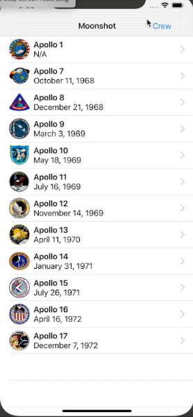

# Moonshot
**SwiftUI app: ScrollView, GeometryReader, Codable & Generics, NavigationLink**

## Day 41 - Challenges

> 1. Add the launch date to MissionView, below the mission badge.

> 2. Modify AstronautView to show all the missions this astronaut flew on.

> 3. Make a bar button in ContentView that toggles between showing launch dates and showing crew names.

## Day 94 - Challenge #1
Change project 8 (Moonshot) so that when you scroll down in MissionView the mission badge image gets smaller. It doesn’t need to shrink away to nothing – going down to maybe 80% is fine.